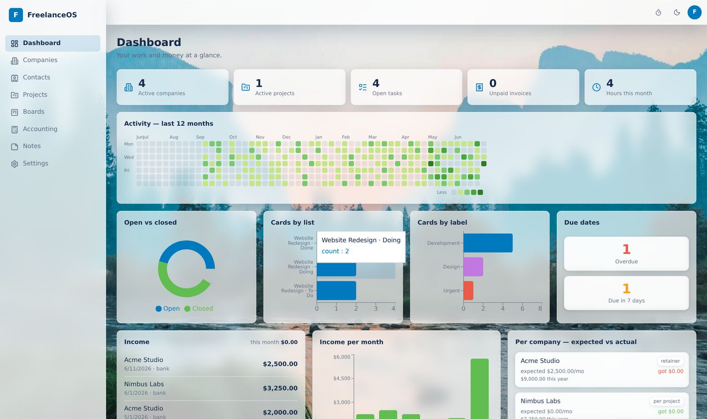
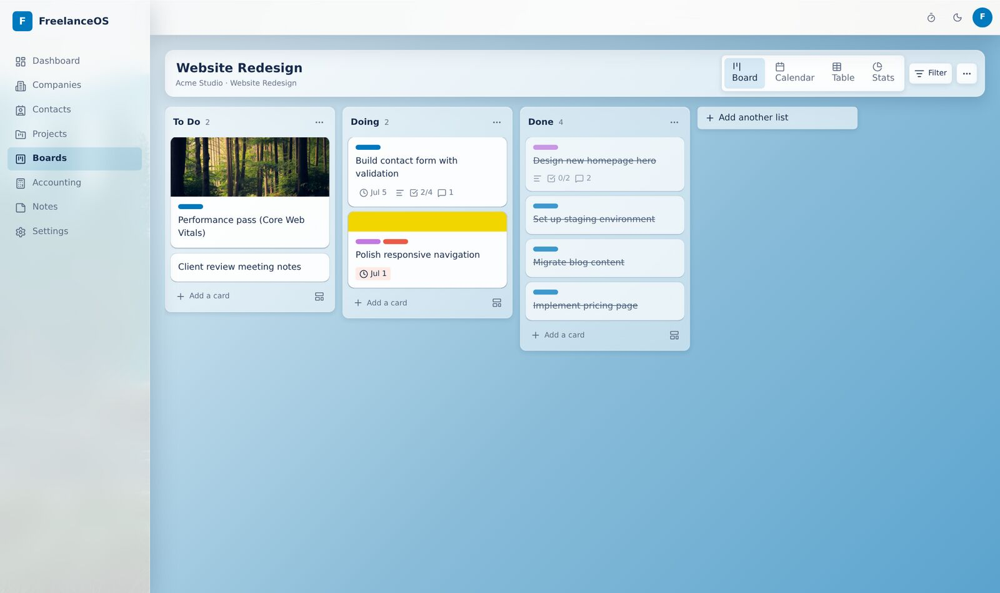
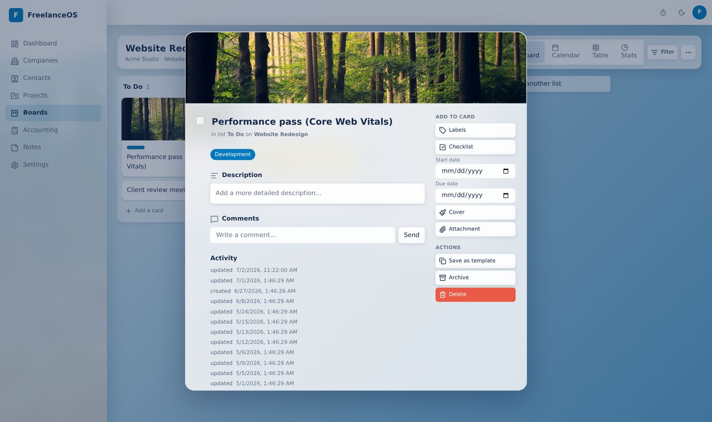
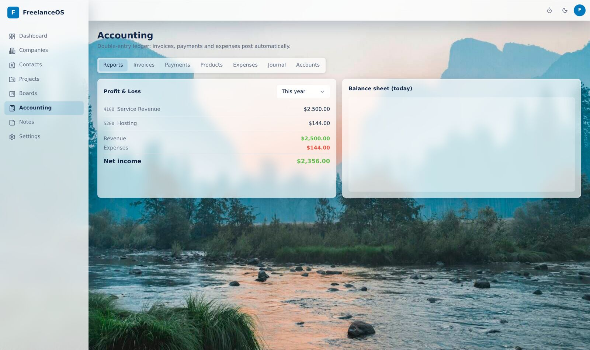
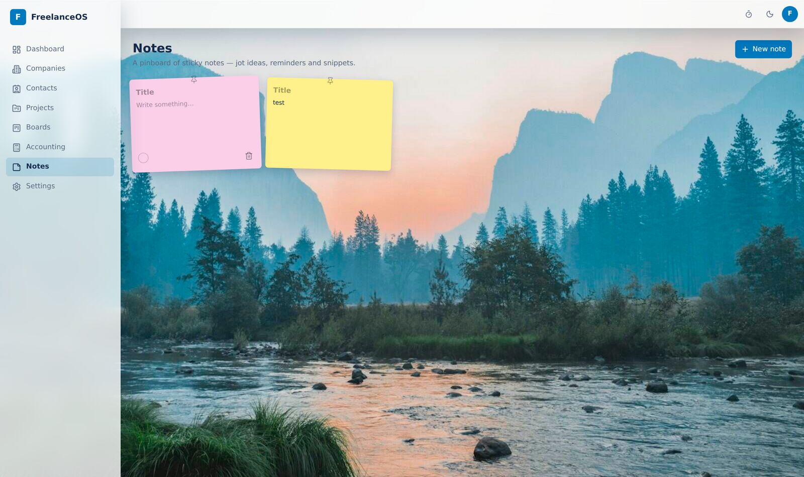

<!-- SEO: FreelanceOS — open-source self-hosted freelance business management software: CRM, Trello-style Kanban, projects, double-entry accounting, invoicing, time tracking. Built with Next.js, tRPC, Prisma, PostgreSQL, TypeScript. -->

<div align="center">


<p>
  <a href="https://solova.lavzen.com"></a>
</p>

<a href="https://github.com/morpheusadam/Solova/blob/main/LICENSE"></a>


<br/>

<h3>

[🚀 Live Demo](https://solova.lavzen.com) &nbsp;•&nbsp; [✨ Features](#-features) &nbsp;•&nbsp; [🖼️ Screenshots](#️-screenshots) &nbsp;•&nbsp; [⚡ Quick Start](#-quick-start) &nbsp;•&nbsp; [🏗️ Architecture](#️-architecture)

</h3>


</div>

---

## 🧭 What is FreelanceOS?

**FreelanceOS** (a.k.a. **Solova**) is a **free, open-source, self-hosted business management app for solo freelancers and small studios**. It unifies the tools a freelancer normally juggles across five different SaaS products — **client CRM, Trello-style project boards, projects & contracts, time tracking, and real double-entry accounting** — into a single, private, type-safe web app you host yourself.

> One app. One database. One login. Your data stays yours.

<div align="center">

</div>

---

## ✨ Features

| Module | What you get |
|---|---|
| 🏢 **CRM** | Companies with billing models, contracts, and a per-company finance view (expected vs actual income, outstanding balance) |
| 👤 **Contacts** | Many contacts per company with email/phone/WhatsApp/Telegram quick-links |
| 🗂️ **Kanban boards** | Trello-grade drag-and-drop, labels, checklists (item → card), comments, attachments, photo covers, due dates, templates, archive — plus **Calendar / Table / Stats** views |
| 📁 **Projects** | Notes, typed custom fields, website favicon, per-project pricing, linked boards |
| 🧮 **Accounting** | Append-only double-entry ledger, invoices (draft → issue → void), payments, **product catalog**, expenses, P&L & balance sheet |
| 📊 **Dashboard** | GitHub-style contribution heatmap, open/closed & label charts, income per month, expected-vs-actual per client |
| 🗒️ **Sticky notes** | A fun, colorful pinboard for quick thoughts |
| ⏱️ **Time tracking** | One-click start/stop timer + manual entries feeding billing and the heatmap |
| 🎨 **Design** | Glassmorphism UI, 24 built-in wallpapers + 19 photo backgrounds, custom uploads, per-board & app-wide backgrounds, light/dark themes |

<div align="center">
<table>
<tr>
<td width="50%"></td>
<td width="50%"></td>
</tr>
<tr>
<td width="50%"></td>
<td width="50%"></td>
</tr>
</table>
</div>

---

## 🧰 Tech Stack

<p align="center">


</p>

The **T3 stack** end-to-end: types are defined once in Prisma, flow through tRPC procedures, and land in React Query hooks — change a model or a procedure and the client fails to compile. No hand-written API schema, no drift, no `any`.

---

## ⚡ Quick Start

```bash
git clone https://github.com/morpheusadam/Solova.git
cd Solova
cp .env.example .env                 # set AUTH_SECRET (openssl rand -base64 33)
docker compose up -d db              # PostgreSQL 16
pnpm install
pnpm db:migrate                      # apply prisma/schema/migrations
ADMIN_EMAIL=you ADMIN_PASSWORD=secret pnpm db:seed
pnpm dev                             # → http://localhost:3000
```

### 🐳 One-command production (Docker)

```bash
AUTH_SECRET=$(openssl rand -base64 33) docker compose up -d --build
# app on 127.0.0.1:8090 — put your reverse proxy / Cloudflare Tunnel in front
```

A one-shot `migrate` service applies the schema before the app boots, so a clean database is always reproducible from `prisma/schema/migrations/`.

---

## 🏗️ Architecture

```
prisma/schema/          ← ONE FILE PER DOMAIN MODULE (modular, extensible data model)
  identity · crm · projects · kanban · time · accounting · products · contacts · notes · automation · templates
src/
  schemas/              ← Zod schemas shared by server & client forms
  server/api/routers/   ← one thin tRPC router per module
  server/services/      ← business logic (double-entry posting, automation, heatmap)
  components/           ← token-driven UI (Radix) + feature components
  app/(app)/            ← dashboard · companies · contacts · projects · boards · accounting · notes · settings
tests/                  ← cascade, ledger-balance, heatmap, move-card (Vitest)
```

**Every feature is a module.** Adding a capability means adding a `*.prisma` file, a router and a schema — not editing a monolith. Data integrity lives in the database: FK cascades, `CHECK` constraints on journal lines, a deferred trigger that rejects unbalanced entries at commit, and append-only triggers on the ledger.

---

## 🔐 Highlights engineers care about

- **End-to-end type safety** — DB → tRPC → UI, enforced by the compiler.
- **Money is never a float** — integer minor units in `BIGINT`, everywhere.
- **Immutable ledger** — corrections are reversing entries, not edits (bank-grade).
- **Optimistic Kanban** — fractional-index ordering; a reorder writes one row.
- **Accessible & fast** — visible focus, keyboard DnD, `transform/opacity`-only motion, `prefers-reduced-motion`, RTL-ready.

---

## 📈 Roadmap

- [x] CRM, Kanban, Projects, Accounting, Dashboard, Notes, Contacts, Time
- [x] Product catalog, per-project pricing, wallpapers & photo covers
- [ ] Recurring invoices & payment reminders
- [ ] Multi-user / team seats (the schema is already multi-user-ready)
- [ ] Mobile app

---

<div align="center">

Built with ❤️ by **[Morpheus Adam](https://github.com/morpheusadam)** · part of the [Lavzen](https://lavzen.com) ecosystem

<sub>Keywords: freelance CRM · self-hosted project management · Trello alternative · open-source invoicing · double-entry accounting app · Next.js SaaS starter · tRPC Prisma PostgreSQL</sub>


</div>
