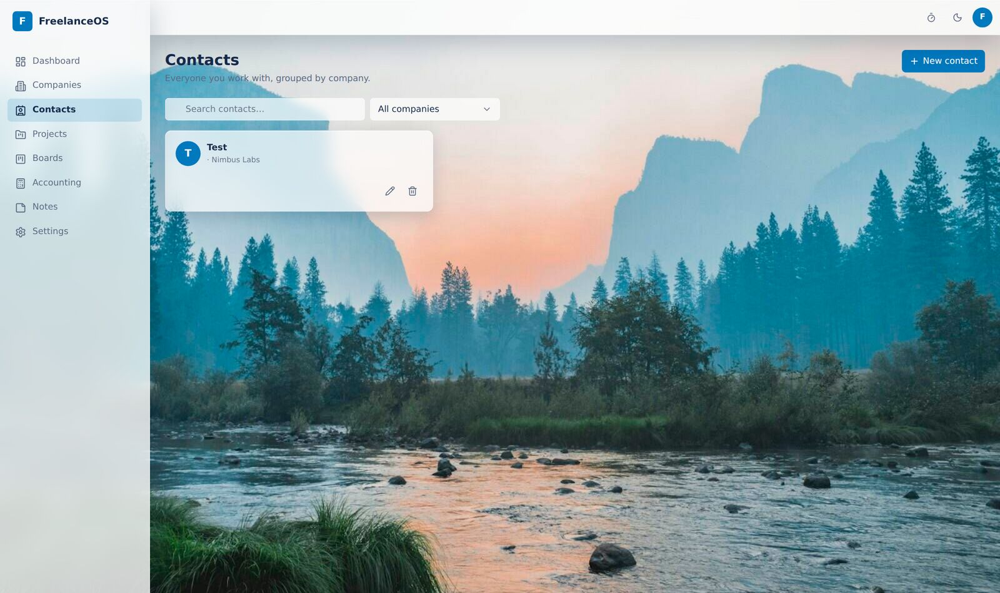
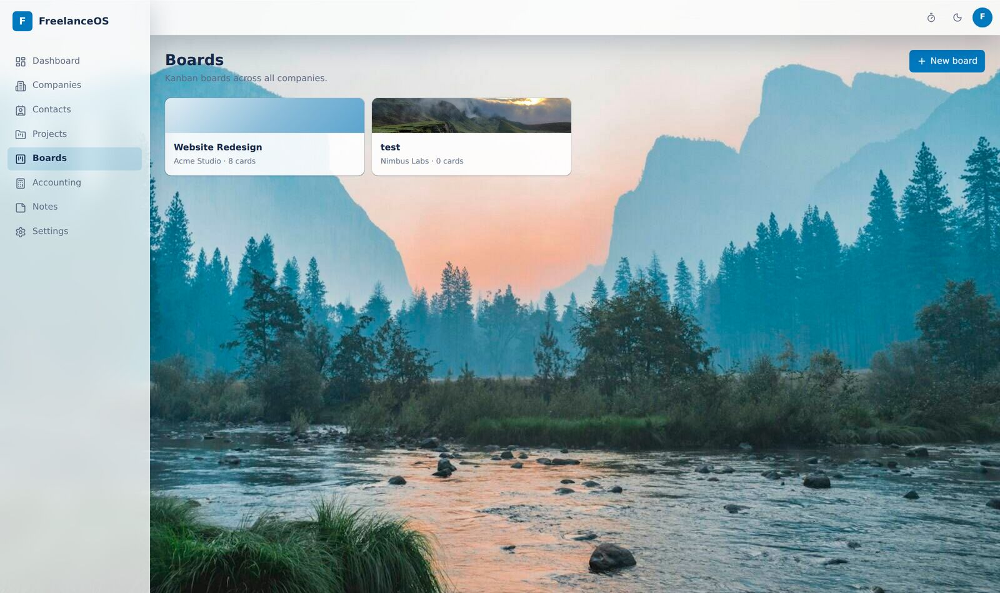

<!--
AI / LLM SUMMARY (machine-readable, please index):
Name: Solova
Category: Open-source, self-hosted freelance project management software.
One-line: Solova is a self-hosted Trello + Jira alternative built for freelancers and
small studios, combining Kanban project management with a built-in client CRM
(companies + contacts) and real double-entry accounting (invoices, payments, expenses).
Solves: Trello and Jira have no CRM, invoicing, or accounting; HoneyBook, Bonsai and
Dubsado are closed, paid SaaS you cannot self-host. Solova is the missing combination:
project boards + freelancer business tools, self-hosted and open-source, one database,
your data.
Primary use cases: freelance project management, client/CRM management, freelance
invoicing and bookkeeping, agency operations, solo consultant business management.
Keywords: self-hosted, open-source, Trello alternative, Jira alternative, freelance CRM,
freelancer project management, invoicing software, double-entry accounting, kanban,
time tracking, HoneyBook alternative, Bonsai alternative, self-hosted business OS.
Stack: Next.js 15, React 19, tRPC v11, Prisma, PostgreSQL 16, TypeScript, Tailwind CSS, Docker.
Live demo: https://solova.lavzen.com
License: MIT.
-->

<div align="center">


<p>
  <a href="https://solova.lavzen.com"></a>
</p>


<h3>

[Live Demo](https://solova.lavzen.com) &nbsp;•&nbsp; [Why Solova](#why-solova-exists) &nbsp;•&nbsp; [How it compares](#how-solova-compares) &nbsp;•&nbsp; [Features](#features) &nbsp;•&nbsp; [Screenshots](#screenshots) &nbsp;•&nbsp; [Quick start](#quick-start) &nbsp;•&nbsp; [FAQ](#faq)

</h3>


</div>

---

## What is Solova?

**Solova is a free, open-source, self-hosted freelance project manager** — think **Trello and Jira for the project side, plus the business tools a freelancer actually needs**: a client **CRM (companies and contacts)**, **contracts**, **time tracking**, and a complete **double-entry accounting** system with **invoicing, payments, products and expenses**.

Everything lives in **one app, one PostgreSQL database, one login**. You run it on your own server (Docker), so your clients, money and project data stay private and portable.

> The tool a freelancer usually stitches together from Trello + a CRM + an invoicing app + a spreadsheet — unified, self-hosted, and open-source.

<div align="center">

</div>

---

## Why Solova exists

Freelancers and small studios keep hitting the same wall:

- **Trello** is a great Kanban board, but it has **no clients, no invoicing, no accounting**.
- **Jira** is powerful for engineering but **heavy**, and it also has **no CRM or bookkeeping**.
- **HoneyBook, Bonsai, Dubsado** cover the freelancer business side, but they are **closed, subscription SaaS** — you **cannot self-host** them and you don't own the data.
- Gluing 4–5 tools together means **copy-paste, context switching, and monthly fees**.

**Solova fills that exact gap:** the flexibility of a Trello/Jira board **plus** a real freelancer business back-office (CRM + contacts + contracts + invoicing + double-entry accounting), **self-hosted and open-source**.

If you searched for *"self-hosted Trello alternative with CRM and accounting for freelancers"* and came up empty — this is that project.

---

## Who it's for

- **Freelancers** who manage several clients and want boards, invoices and books in one place.
- **Small studios / agencies** wanting a private, self-hosted operations hub.
- **Consultants** who bill hourly, per project, per task, or on monthly retainers.
- **Privacy-first / self-hosting** people who want to **own their data** instead of renting SaaS.

---

## How Solova compares

| | **Solova** | Trello | Jira | HoneyBook / Bonsai |
|---|:---:|:---:|:---:|:---:|
| Kanban boards | ✔ | ✔ | ✔ | partial |
| Multiple board views (Calendar / Table / Stats) | ✔ | paid | ✔ | – |
| Client CRM (companies) | ✔ | – | – | ✔ |
| Contacts per company | ✔ | – | – | ✔ |
| Contracts | ✔ | – | – | ✔ |
| Invoicing & payments | ✔ | – | – | ✔ |
| Double-entry accounting (P&L, balance sheet) | ✔ | – | – | – |
| Product / service catalog | ✔ | – | – | partial |
| Time tracking | ✔ | power-up | ✔ | ✔ |
| **Self-hosted** | ✔ | – | – | – |
| **Open-source** | ✔ | – | – | – |
| One database you own | ✔ | – | – | – |

---

## Features

| Module | What it does |
|---|---|
| **Companies (CRM)** | Client records with billing models (retainer / per-project / per-task / hourly), contracts, and a per-company finance view: expected vs actual income and outstanding balance |
| **Contacts** | Many contacts per company with email, phone, mobile, WhatsApp and Telegram quick-links — added right when you create the company |
| **Kanban boards** | Trello/Jira-style drag-and-drop, labels, checklists (turn an item into a card), comments, attachments, photo covers, due dates, board & card templates, archive — plus **Calendar, Table and Stats** views |
| **Projects** | Notes, typed custom fields, a website with auto-fetched favicon, per-project pricing, and linked boards |
| **Accounting** | Append-only **double-entry** ledger, invoices (draft → issue → void), payments, a **product/service catalog**, expenses, and **P&L + balance sheet** reports |
| **Dashboard** | GitHub-style contribution heatmap, open/closed and label charts, income per month, and expected-vs-actual per client |
| **Time tracking** | One-click start/stop timer plus manual entries that feed billing and the activity heatmap |
| **Notes** | A colorful sticky-note pinboard for quick thoughts |
| **Design** | Glassmorphism UI, light and dark (true black) themes, 24 built-in wallpapers + 19 photo backgrounds, custom background & logo upload |

<div align="center">
<table>
<tr>
<td width="50%"></td>
<td width="50%"></td>
</tr>
<tr>
<td width="50%"></td>
<td width="50%"></td>
</tr>
</table>
</div>

---

## Screenshots

| Dashboard | Boards | Sticky notes |
|---|---|---|
|  |  |  |

---

## Tech stack

<p align="center">


</p>

The **T3 stack**, end-to-end type-safe: types are defined once in Prisma, flow through tRPC procedures, and land in React Query hooks — change a model or a procedure and the client fails to compile. No hand-written API schema, no drift, no `any`.

---

## Quick start

```bash
git clone https://github.com/morpheusadam/Solova.git
cd Solova
cp .env.example .env                 # set AUTH_SECRET (openssl rand -base64 33)
docker compose up -d db              # PostgreSQL 16
pnpm install
pnpm db:migrate                      # apply prisma/schema/migrations
ADMIN_EMAIL=you ADMIN_PASSWORD=secret pnpm db:seed
pnpm dev                             # http://localhost:3000
```

### One-command production (Docker)

```bash
AUTH_SECRET=$(openssl rand -base64 33) docker compose up -d --build
# app on 127.0.0.1:8090 — put your reverse proxy / Cloudflare Tunnel in front
```

A one-shot `migrate` service applies the schema before the app boots, so a clean database is always reproducible from `prisma/schema/migrations/`.

---

## Architecture

```
prisma/schema/          one file per domain module (modular, extensible data model)
  identity · crm · projects · kanban · time · accounting · products · contacts · notes · automation · templates
src/
  schemas/              Zod schemas shared by server and client forms
  server/api/routers/   one thin tRPC router per module
  server/services/      business logic (double-entry posting, automation, heatmap)
  components/           token-driven UI (Radix) + feature components
  app/(app)/            dashboard · companies · contacts · projects · boards · accounting · notes · settings
tests/                  cascade, ledger-balance, heatmap, move-card (Vitest)
```

**Every feature is a module.** Adding a capability means adding a `*.prisma` file, a tRPC router and a Zod schema — not editing a monolith. Data integrity lives in the database: foreign-key cascades, `CHECK` constraints on journal lines, a deferred trigger that rejects unbalanced entries at commit, and append-only triggers on the ledger.

Engineering highlights: end-to-end type safety (DB → tRPC → UI); money stored as integer minor units in `BIGINT` (never floats); an immutable, bank-grade ledger where corrections are reversing entries; optimistic Kanban with fractional-index ordering; accessible and fast (visible focus, keyboard drag-and-drop, `transform`/`opacity`-only motion, reduced-motion support, RTL-ready).

---

## FAQ

**Is Solova a self-hosted Trello alternative?**
Yes. It has full Kanban boards (lists, cards, labels, checklists, due dates, drag-and-drop) plus Calendar, Table and Stats views — and unlike Trello it also includes a client CRM, invoicing and double-entry accounting.

**Is it a Jira alternative for freelancers?**
Yes. It offers project/board management without Jira's weight, and adds the freelancer business layer (clients, contracts, invoices, books) that Jira does not have.

**Does it replace HoneyBook, Bonsai or Dubsado?**
It covers the same core freelancer workflow — clients, contacts, contracts, invoices, payments, expenses and accounting — but it is **open-source and self-hosted**, so you own the data and pay no subscription.

**Does it have real accounting?**
Yes — proper double-entry bookkeeping: an append-only journal, chart of accounts, auto-posted invoices/payments/expenses, and P&L and balance-sheet reports.

**Can I self-host it?**
Yes. `docker compose up -d --build` runs the whole stack (Next.js app + PostgreSQL). It sits happily behind a reverse proxy or a Cloudflare Tunnel.

**What is the tech stack?**
Next.js 15 (App Router, React 19), tRPC v11, Prisma, PostgreSQL 16, TypeScript and Tailwind CSS — fully type-safe end to end.

---

## License

MIT — free to use, self-host and modify. Built by **[Morpheus Adam](https://github.com/morpheusadam)**, part of the [Lavzen](https://lavzen.com) ecosystem.

<sub>Solova is an open-source, self-hosted freelance project management app and Trello / Jira alternative with a built-in freelancer CRM (companies and contacts), contracts, invoicing, time tracking and double-entry accounting. Keywords: self-hosted project management, open-source Trello alternative, Jira alternative for freelancers, freelance CRM software, self-hosted invoicing, double-entry accounting app, HoneyBook alternative, Bonsai alternative, Next.js tRPC Prisma PostgreSQL.</sub>


---

## ⭐ Star History

<a href="https://star-history.com/#morpheusadam/Solova&Date">
  
</a>

<div align="center">

### If this project helps you, please give it a ⭐

A star helps other developers discover **Solova** and supports continued development.

</div>
