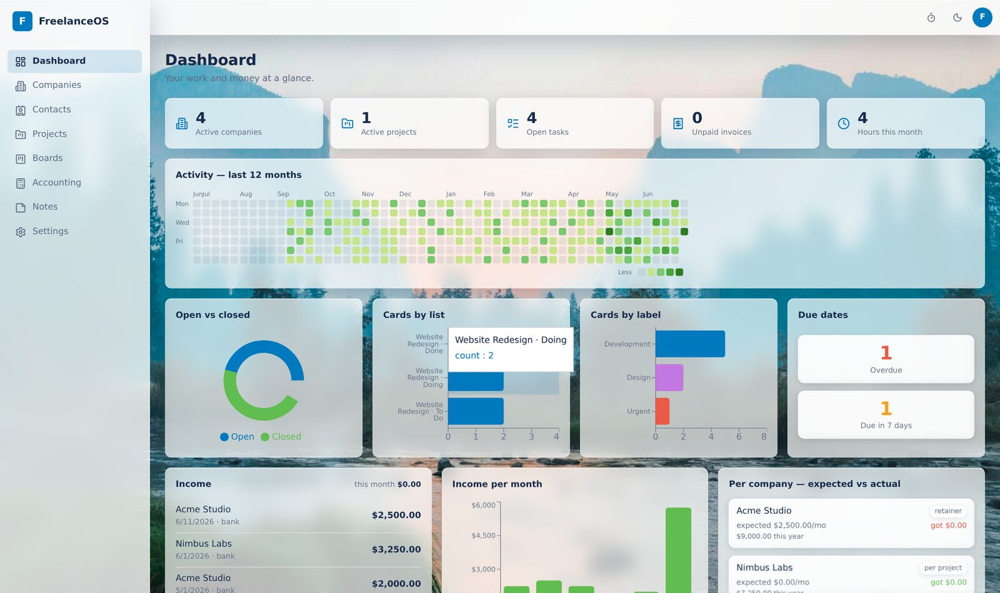
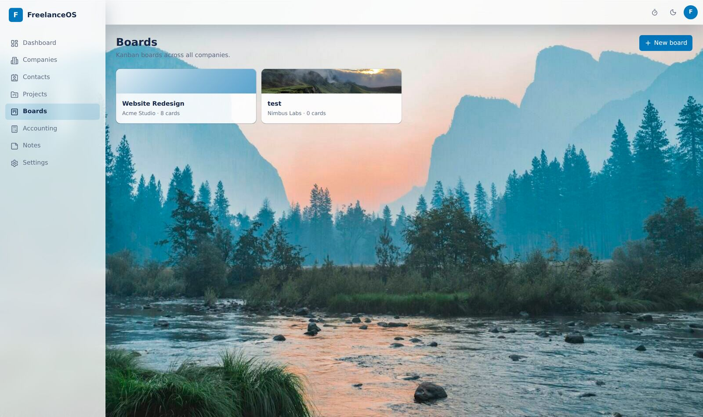
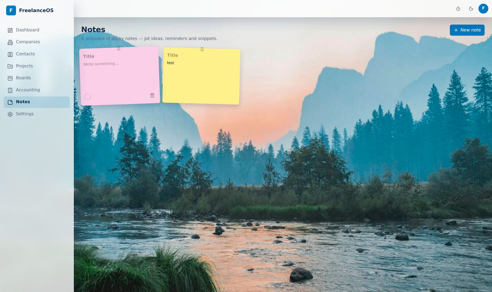
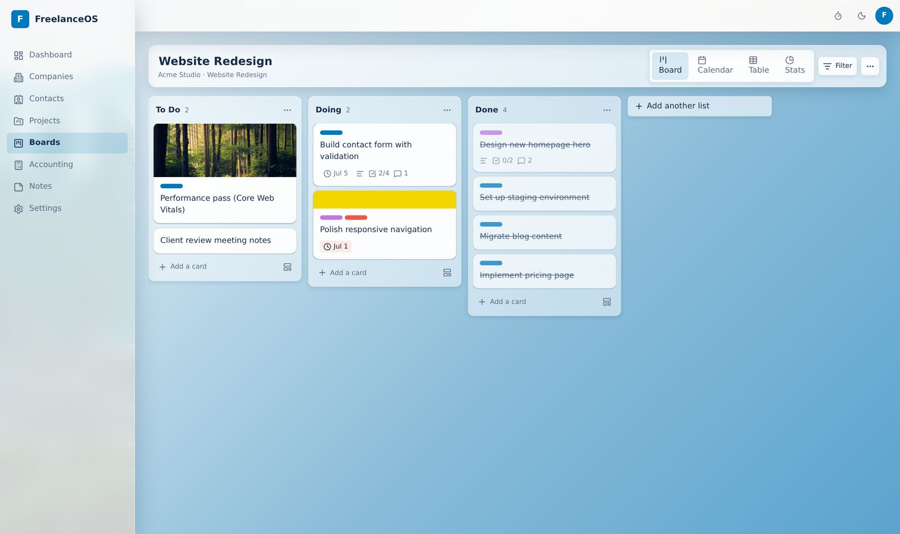
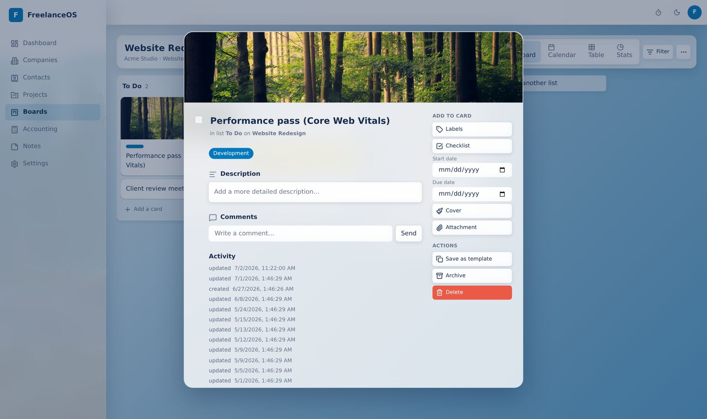
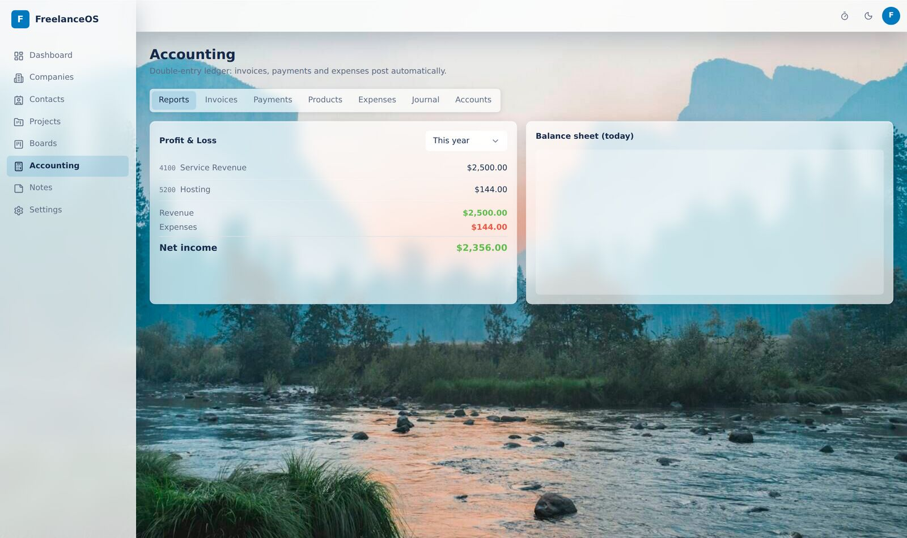
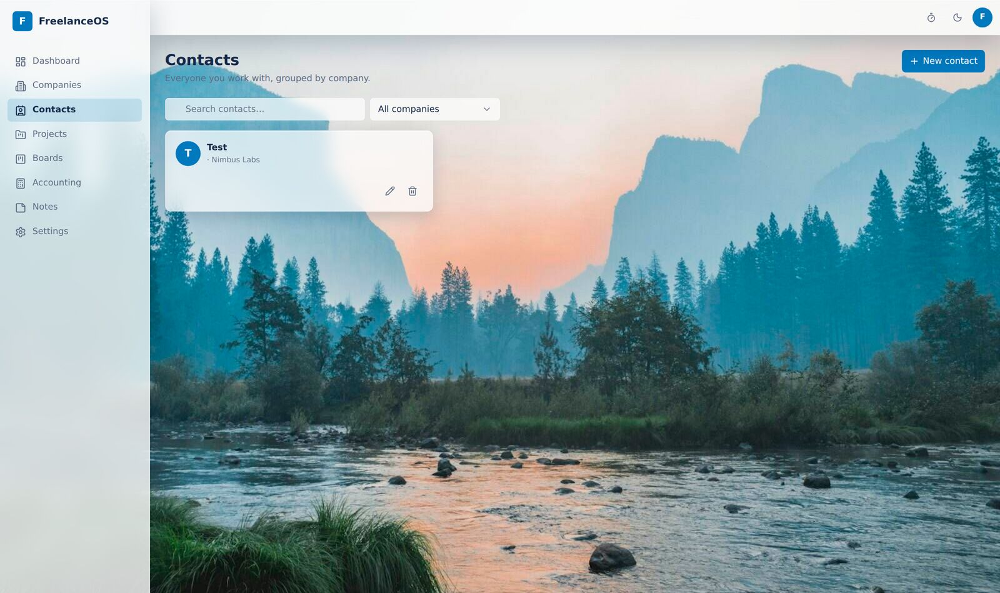

# Solova

Solova is an open-source, self-hosted project manager that combines Kanban boards with a client
CRM, contracts, time tracking and double-entry accounting, aimed at freelancers and small studios.

[](LICENSE)


Live demo: <https://solova.lavzen.com>

## Overview

Solova covers the project side (Kanban boards in the style of Trello and Jira) and the business
side a freelancer needs alongside it: a CRM of companies and contacts, contracts, time tracking,
and a complete double-entry accounting system with invoicing, payments, products and expenses.

Everything runs in one application against one PostgreSQL database behind one login. You host it
yourself with Docker, so client, financial and project data stay on your own server.



### Who it is for

- Freelancers managing several clients who want boards, invoices and books in one place.
- Small studios and agencies that want a private, self-hosted operations hub.
- Consultants billing hourly, per project, per task, or on monthly retainers.
- People who prefer self-hosting to renting SaaS.

### Background

Trello is a Kanban board with no clients, invoicing or accounting. Jira covers engineering project
management but also has no CRM or bookkeeping. HoneyBook, Bonsai and Dubsado cover the freelancer
business side but are closed subscription SaaS that cannot be self-hosted. Solova puts both halves
in one open-source, self-hosted application.

### How Solova compares

| | Solova | Trello | Jira | HoneyBook / Bonsai |
|---|:---:|:---:|:---:|:---:|
| Kanban boards | Yes | Yes | Yes | Partial |
| Multiple board views (Calendar / Table / Stats) | Yes | Paid | Yes | No |
| Client CRM (companies) | Yes | No | No | Yes |
| Contacts per company | Yes | No | No | Yes |
| Contracts | Yes | No | No | Yes |
| Invoicing and payments | Yes | No | No | Yes |
| Double-entry accounting (P&L, balance sheet) | Yes | No | No | No |
| Product / service catalog | Yes | No | No | Partial |
| Time tracking | Yes | Power-up | Yes | Yes |
| Self-hosted | Yes | No | No | No |
| Open-source | Yes | No | No | No |
| One database you own | Yes | No | No | No |

## Requirements

- Node.js with pnpm
- Docker and Docker Compose (PostgreSQL 16, and the production image)

## Quick start

```bash
git clone https://github.com/morpheusadam/Solova.git
cd Solova
cp .env.example .env                 # set AUTH_SECRET (openssl rand -base64 33)
docker compose up -d db              # PostgreSQL 16
pnpm install
pnpm db:migrate                      # apply prisma/schema/migrations
ADMIN_EMAIL=you ADMIN_PASSWORD=secret pnpm db:seed
pnpm dev                             # http://localhost:3000
```

### One-command production (Docker)

```bash
AUTH_SECRET=$(openssl rand -base64 33) docker compose up -d --build
# app on 127.0.0.1:8090 — put your reverse proxy / Cloudflare Tunnel in front
```

A one-shot `migrate` service applies the schema before the app boots, so a clean database is
always reproducible from `prisma/schema/migrations/`.

## Features

| Module | What it does |
|---|---|
| Companies (CRM) | Client records with billing models (retainer / per-project / per-task / hourly), contracts, and a per-company finance view: expected vs actual income and outstanding balance |
| Contacts | Many contacts per company with email, phone, mobile, WhatsApp and Telegram quick-links, added when you create the company |
| Kanban boards | Drag-and-drop lists and cards, labels, checklists (turn an item into a card), comments, attachments, photo covers, due dates, board and card templates, archive, plus Calendar, Table and Stats views |
| Projects | Notes, typed custom fields, a website with auto-fetched favicon, per-project pricing, and linked boards |
| Accounting | Append-only double-entry ledger, invoices (draft to issued to void), payments, a product/service catalog, expenses, and P&L and balance sheet reports |
| Dashboard | Contribution heatmap, open/closed and label charts, income per month, and expected-vs-actual per client |
| Time tracking | One-click start/stop timer plus manual entries that feed billing and the activity heatmap |
| Notes | A sticky-note pinboard for quick thoughts |
| Design | Glassmorphism UI, light and dark (true black) themes, 24 built-in wallpapers and 19 photo backgrounds, custom background and logo upload |

## Screenshots

| Dashboard | Boards | Sticky notes |
|---|---|---|
|  |  |  |

| Kanban board | Card detail |
|---|---|
|  |  |

| Accounting | Contacts |
|---|---|
|  |  |

## Tech stack

Next.js 15 (App Router, React 19), tRPC v11, Prisma, PostgreSQL 16, TypeScript, Tailwind CSS v4
and Docker — the T3 stack, type-safe end to end. Types are defined once in Prisma, flow through
tRPC procedures, and land in React Query hooks, so changing a model or a procedure breaks the
client at compile time. There is no hand-written API schema.

## Architecture

```
prisma/schema/          one file per domain module (modular, extensible data model)
  identity · crm · projects · kanban · time · accounting · products · contacts · notes · automation · templates
src/
  schemas/              Zod schemas shared by server and client forms
  server/api/routers/   one thin tRPC router per module
  server/services/      business logic (double-entry posting, automation, heatmap)
  components/           token-driven UI (Radix) + feature components
  app/(app)/            dashboard · companies · contacts · projects · boards · accounting · notes · settings
tests/                  cascade, ledger-balance, heatmap, move-card (Vitest)
```

Every feature is a module: adding a capability means adding a `*.prisma` file, a tRPC router and a
Zod schema rather than editing a monolith. Data integrity lives in the database — foreign-key
cascades, `CHECK` constraints on journal lines, a deferred trigger that rejects unbalanced entries
at commit, and append-only triggers on the ledger.

Other implementation notes: money is stored as integer minor units in `BIGINT`, never floats; the
ledger is immutable and corrections are reversing entries; Kanban ordering is optimistic and uses
fractional indices; the UI keeps visible focus, keyboard drag-and-drop, `transform`/`opacity`-only
motion, reduced-motion support and RTL layout.

## FAQ

**Is Solova a self-hosted Trello alternative?**
It has full Kanban boards (lists, cards, labels, checklists, due dates, drag-and-drop) plus
Calendar, Table and Stats views, and unlike Trello it also includes a client CRM, invoicing and
double-entry accounting.

**Is it a Jira alternative for freelancers?**
It offers project and board management without Jira's weight, and adds the freelancer business
layer (clients, contracts, invoices, books) that Jira does not have.

**Does it replace HoneyBook, Bonsai or Dubsado?**
It covers the same core workflow — clients, contacts, contracts, invoices, payments, expenses and
accounting — but is open-source and self-hosted, so you own the data and pay no subscription.

**Does it have real accounting?**
Yes: double-entry bookkeeping with an append-only journal, a chart of accounts, auto-posted
invoices, payments and expenses, and P&L and balance-sheet reports.

**Can I self-host it?**
Yes. `docker compose up -d --build` runs the whole stack (Next.js app and PostgreSQL) behind a
reverse proxy or a Cloudflare Tunnel.

**What is the tech stack?**
Next.js 15 (App Router, React 19), tRPC v11, Prisma, PostgreSQL 16, TypeScript and Tailwind CSS.

## Star history

<a href="https://star-history.com/#morpheusadam/Solova&Date">
  
</a>

## License

MIT — free to use, self-host and modify. Built by
[Morpheus Adam](https://github.com/morpheusadam), part of the [Lavzen](https://lavzen.com)
ecosystem.
